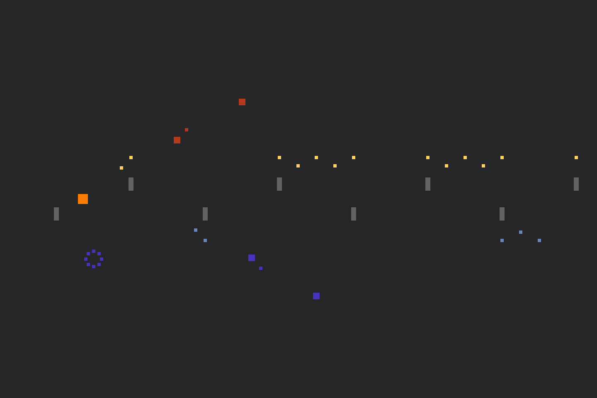

# Untitled-2

Author: Rain Du

Design: A rhythm game (I would call this a demo version) that looks a lot like a shooting platformer.

Screen Shot:

And [here](https://youtu.be/y9LkzDODqvc)'s a screen recording of a pretty good play through.

How To Play:

`a`: the orange square jumps up, or if already in air, shoot a bullet.  
`l`: the shadow jumps down, or if already in air, shoot a bullet.  
Or, hold down `a` or `l` to float  

`space`: both the square and its shadow jump (with extra power).

Sources:

Soundtrack is by 希望索任合资, [here](https://www.weibo.com/u/1591256395) is his Weibo. The whole track could be found at [this Weibo link](https://www.weibo.com/tv/v/I1028pKI5?fid=1034:4402383103716082).

The composer is generous to let me use his work, but for this assignment only. So I'm not uploading the original file here. I did place a copy of the .wav file I used in the handin folder, so the game builds over there and can be graded.

Other things that I didn't create or come up with over this weekend: 
* most of the drawing code, which I copied over from game 0 base code
* the idea of the GameObject class, which I took from an in-progress side project (and when working on that I was thinking about Unity). 

This game was built with [NEST](NEST.md).
